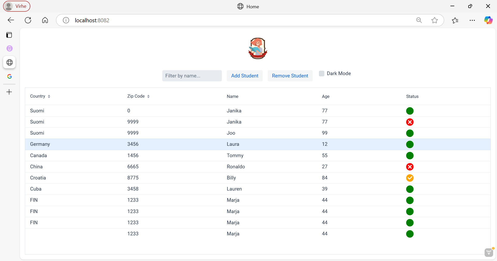
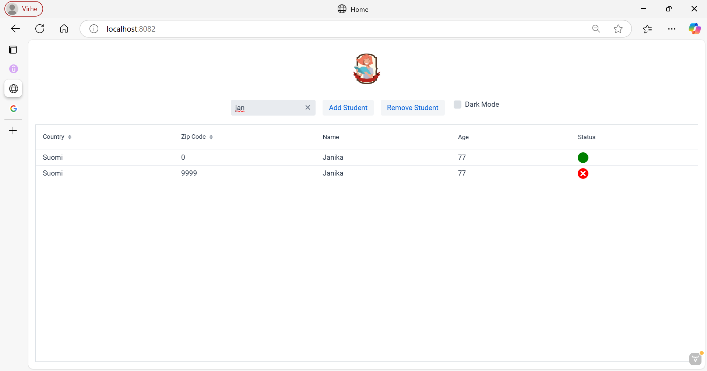
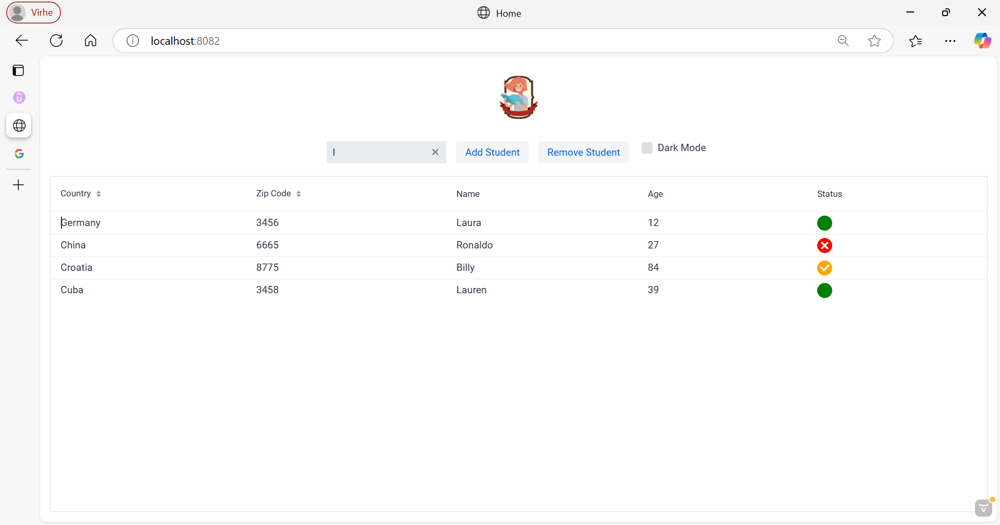
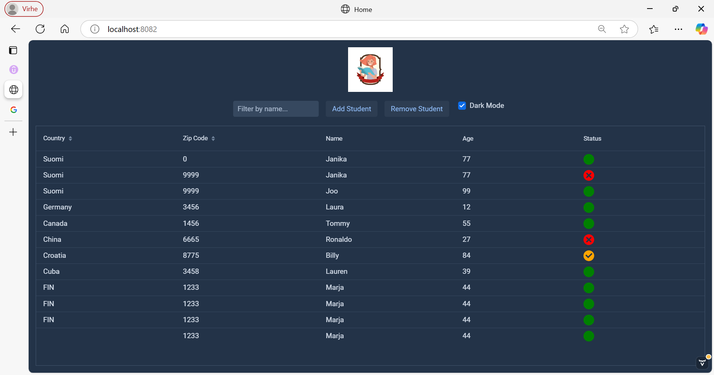
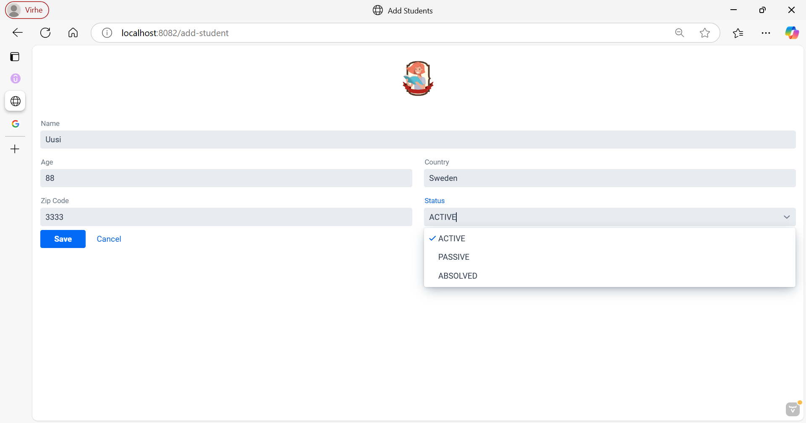

Udemun kurssilla Java EE with Vaadin, JPA, Microservices, Spring and Maven kurssilla tekemäni harjoitustyö.
Teknologiat:

- Vaadin (UI komponenteille)
- Java
- Spring Boot
- SQL (MySQL)
- Maven
- Eclipse

Sovelluksen käyttöliittymästä voi selailla opiskelijoiden tietoja. Näytettäviä opiskelijoita voi filtteröidä nimen perusteella.
Status kuvakkeen väri riippuu opiskelijan tilasta: aktiivinen, passiivinen tai vapautunut.
Käyttöliittymässä on myös nappi, jota painamalla voi vaihtaa ulkoasun värimaailman tummaan.
Add Student napista pääsee eri näkymään, josta voi lisätä uuden opiskelijan. Kyseisessä näkymässä on myös nappi, jota painamalla voi palata etusivulle.
Kun uuden opiskelijan lisää onnistuneesti, tulee siitä ilmoitus käyttäjälle.
Käyttöliittymään on tarkoitus vielä lisätä validointi syötteille sekä mahdollistaa opiskelijoiden poistaminen.

Opiskelijoiden tiedot lisätään ja haetaan tietokannasta, jona toimii MySQL.
MySQL tietokannassa on kaksi taulua: student ja status.
Taulujen välillä on liitos, kun käyttöliittymästä lisätään opiskelija, listataan vain status taulusta löytyvät vaihtoehdot status kenttään, joista opiskelija voi valita.

Tutustuin vaadin kehykseen pikaisesti työnhaun yhteydessä. Sitä oli erittäin mukava käyttää, ja nautin tästä pikaisesta projektista suuresti, ja tulen varmasti jatkamaan aiemmin mainitut ominaisuudet siihen loppuun.

